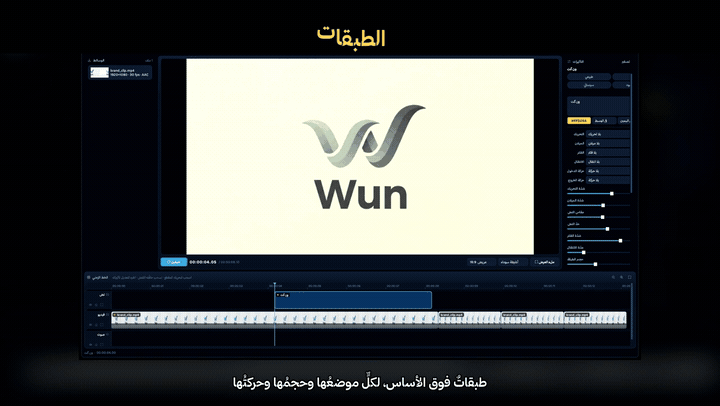

<div align="center">


# وِن كَت · Wun Cut

**محرّر فيديو عربيّ · مجّاني · يعمل بلا إنترنت**

</div>

---

## المقطع التعريفيّ

<div align="center">

[](docs/wun_cut.mp4)

**▶ [شاهد المقطع كاملًا (٢:٤٠ دقيقة)](docs/wun_cut.mp4)**

</div>

المقطع مصنوعٌ بالبرنامج نفسه — ١٢٨٠×٧٢٠ بستّين إطارًا — ويشرح كلّ ما هو مذكورٌ تحت: الانتقالات وحركة الكاميرا وانقلاب البطاقات وأنيميشن الحروف والملصقات والتصدير. والصورة المتحرّكة أعلاه ثلاث قصاصاتٍ منه.

---

## الفهرس

1. [ما هذا البرنامج](#ما-هذا-البرنامج)
2. [التثبيت](#التثبيت)
3. [أوّل مقطع في خمس دقائق](#أوّل-مقطع-في-خمس-دقائق)
4. [الواجهة](#الواجهة)
5. [العمل على الخطّ الزمنيّ](#العمل-على-الخطّ-الزمنيّ)
6. [لوحة التأثيرات](#لوحة-التأثيرات)
7. [النصّ وأنيميشن الحروف](#النصّ-وأنيميشن-الحروف)
8. [الملصقات](#الملصقات)
9. [الطبقات](#الطبقات)
10. [الانتقالات](#الانتقالات)
11. [التصدير](#التصدير)
12. [ماذا يستعمل البرنامج عند التصدير](#ماذا-يستعمل-البرنامج-عند-التصدير)
13. [اختصارات لوحة المفاتيح](#اختصارات-لوحة-المفاتيح)
14. [حالة ديسكورد](#حالة-ديسكورد)
15. [الإزالة](#الإزالة)
16. [للمطوّرين](#للمطوّرين)
17. [حلّ المشكلات](#حلّ-المشكلات)

---

## ما هذا البرنامج

محرّر فيديو لسطح المكتب، عربيٌّ في واجهته واتّجاهه، مبنيٌّ على **PySide6** للواجهة و**FFmpeg** للترميز. كلّ شيء يجري على جهازك: لا رفع، لا حساب، لا اتّصال.

**ما يميّزه عن غيره:**

| | |
|---|---|
| **عربيٌّ أصالةً** | الواجهة من اليمين لليسار، والنصّ العربيّ يُشكَّل ويُوصل حروفه صحيحًا في الفيديو الناتج — لا حروفًا منفصلة مقلوبة |
| **بلا إنترنت** | FFmpeg مرفقٌ داخل البرنامج، فلا تنزيل ولا إعداد |
| **المعاينة = الناتج** | المعاينة تُرمَّز بمحرّك التصدير نفسه، فما تراه هو ما يخرج بالضبط |
| **لغتان** | عربيّ وإنجليزيّ، يُبدَّل من زرٍّ في الشريط العلويّ |

**يحتاج:** ويندوز ١٠ أو أحدث · ٦٤ بت.

---

## التثبيت

نزّل `Wun Cut Setup.exe` وشغّله. المثبّت:

1. يعرض مسار التثبيت (الافتراضيّ `%LOCALAPPDATA%\Programs\Wun Cut`) ويمكن تغييره.
2. ينسخ البرنامج ومعه FFmpeg.
3. يُنشئ اختصارًا على سطح المكتب وفي قائمة ابدأ.
4. يسجّل البرنامج في «إضافة أو إزالة البرامج».

لا يحتاج صلاحيّات مدير: التثبيت في مجلّد المستخدم.

**تثبيتٌ صامت** (للنشر الآليّ):

```bash
"Wun Cut Setup.exe" --silent --dir "C:\Path\To\Wun Cut" --no-shortcuts
```

---

## أوّل مقطع في خمس دقائق

1. **استورد وسائط** (`Ctrl+I`) — اختر مقاطعك وصورك.
2. **اسحبها إلى الخطّ الزمنيّ**، أو اضغط «أضف للخطّ الزمنيّ».
3. **انقر مقطعًا** فتفتح لوحة التأثيرات على يمينه.
4. **اقسم** (`S`) عند رأس التشغيل، و**احذف** (`Delete`) ما لا تريده.
5. **أضف نصًّا** (`Ctrl+T`) واكتب فيه، واختر له أنيميشن حروف.
6. **اضغط مسافة** لتشاهد النتيجة.
7. **صدّر** (`Ctrl+E`) واختر المقاس ومعدّل الإطارات.

> أوّل تشغيلٍ للمعاينة يأخذ ثوانيَ قليلة: البرنامج يرمّز المشروع بدقّةٍ منخفضة ثم يشغّل الناتج. وما دام شيءٌ لم يتغيّر، التشغيلات التالية فوريّة.

---

## الواجهة

النافذة ثلاثة أعمدة وشريطٌ سفليّ:

| الجزء | ما فيه |
|---|---|
| **الوسائط** (يمينًا) | الملفّات المستوردة بمصغّراتها ومعلوماتها (المقاس، معدّل الإطارات، الصوت) |
| **المسرح** (وسطًا) | المعاينة، ومعها أزرار التشغيل والوقت ونمط ملء الشاشة (١٦:٩ · أشرطة سوداء · ملء العرض) |
| **التأثيرات** (يسارًا) | خصائص المقطع المحدَّد |
| **الخطّ الزمنيّ** (تحت) | المسارات: نصّ، فيديو، صوت — وطبقاتٌ إضافيّة بحسب ما تضيف |

---

## العمل على الخطّ الزمنيّ

| العمل | كيف |
|---|---|
| تحريك مقطع | اسحبه |
| قصّ من الطرف | اسحب حافّته |
| قسم عند رأس التشغيل | `S` أو زرّ «قسم» |
| حذف | `Delete` |
| تكبير/تصغير | عجلة الفأرة، أو أزرار العدسة |
| ملء العرض | زرّ الإطار |
| تحديد مقطع لتعديله | انقره |

كلّ مسارٍ له أزرار: **كتم** · **إخفاء** · **عزل**.

والتراجع (`Ctrl+Z`) والإعادة (`Ctrl+Y`) يشملان كلّ شيء — القصّ والتحريك والتأثيرات والنصّ.

---

## لوحة التأثيرات

تظهر عند تحديد مقطع. أعلاها أربع **رقاقات مظهر** جاهزة: طبيعي · ساطع · سينمائي · أبيض وأسود.

### اللون والسرعة والصوت

| المؤثّر | المدى | المحايد |
|---|---|---|
| السطوع | −١٠٠ … ١٠٠ | ٠ |
| التباين | −١٠٠ … ١٠٠ | ٠ |
| التشبّع | −١٠٠ … ١٠٠ | ٠ |
| السرعة | ٢٥٪ … ٤٠٠٪ | ١٠٠٪ |
| الصوت | ٠٪ … ٢٠٠٪ | ١٠٠٪ |
| تلاشي الدخول/الخروج | ٠ … ٥٠٠٠ م.ث | ٠ |

### حركة الكاميرا (٨ حركات)

تقريب · إبعاد · تحريك يمينًا · يسارًا · للأعلى · للأسفل · تقريبٌ مع تحريك · **اهتزاز**

الاهتزاز حركةٌ خفيفة تُعطي إحساس الكاميرا المحمولة، وشدّتها تُضبط بمنزلق «شدّة التحريك».

### الميلان (٦ أنماط)

ميلان للداخل · للخارج · لليسار · لليمين · **تمايل** · **قلب بطاقة**

### الانقلاب ثلاثيّ الأبعاد (٦ أنماط)

انقلاب من اليمين · من اليسار · من الأعلى · من الأسفل · **بابٌ يُفتح يسارًا** · **بابٌ يُفتح يمينًا**

هذه انقلاباتٌ منظوريّة حقيقيّة لا تدوير مسطّح: الحافّة القريبة تكبر والبعيدة تصغر أثناء الدوران.

### الفلاتر (١٠)

ضباب · حدّة · تظليل الأطراف · حبيبات · دافئ · بارد · سيبيا · باهت · تباين قويّ · انعكاس

ولكلٍّ منها منزلق شدّة.

### حركات الدخول والخروج (٦)

تقريب · إبعاد · انزلاق من اليمين · من اليسار · من الأسفل · من الأعلى — بمدّةٍ تُضبط بالمللي ثانية.

---

## النصّ وأنيميشن الحروف

`Ctrl+T` يضيف طبقة نصّ. تكتب فيها، وتختار اللون والمحاذاة والمقاس وسماكة الحدّ.

**العربيّة تُرسم مشكَّلةً موصولةً** — البرنامج يُشكّل النصّ أوّلًا ثمّ يقصّه حرفًا حرفًا، لا العكس. ولهذا يعمل أنيميشن الحروف على العربيّة كما يعمل على اللاتينيّة.

### أنيميشن الحروف (٧ أنماط)

| النمط | ما يفعله |
|---|---|
| حرفٌ حرف من اليمين | تدخل الحروف واحدًا بعد واحد من اليمين |
| حرفٌ حرف من اليسار | مثله من الجهة الأخرى |
| حرفٌ حرف من الأعلى | تنزل الحروف تباعًا |
| سقوط | تسقط الحروف بارتداد |
| نبض | يظهر كلّ حرفٍ بقفزة حجم |
| دوران | يدور كلّ حرفٍ حول نفسه وهو يظهر |
| تلاشٍ | تظهر الحروف تباعًا بتلاشٍ |

يُرمَّز الأنيميشن مقطعًا شفّافًا (WebM بقناة ألفا) ويُركَّب فوق الفيديو، فتبقى حوافّ الحروف نظيفة.

---

## الملصقات

`Ctrl+K` يفتح لوحة الملصقات:

**٦٦ ملصقًا** في المجموع:

- **٥٤ إيموجي** في خمس فئات: تفاعلات · إشارات · أيادٍ · ألعاب · قلوب
- **١٢ شكلًا** متّجهًا: أسهم بأربع جهات · دائرة تمييز · مربّع تمييز · فقاعة كلام · نجمة · صحّ · خطأ · انفجار · خطّ تحته

الأشكال تُرسم بلونٍ تختاره، وكلّ ملصقٍ يصير طبقةً لها موضعٌ وحجمٌ وحركةٌ مثل أيّ طبقة.

---

## الطبقات

«أضف كطبقة» يضع صورةً أو مقطعًا **فوق** الفيديو لا بجانبه. ولكلّ طبقة:

| | المدى |
|---|---|
| الموضع الأفقيّ | −١٠٠٪ … ١٠٠٪ |
| الموضع الرأسيّ | −١٠٠٪ … ١٠٠٪ |
| الحجم | ١٠٪ … ٣٠٠٪ |

وتقبل كلّ ما يقبله المقطع الأساسيّ: حركة، ميلان، انقلاب، فلتر، تلاشٍ.

---

## الانتقالات

**٥٨ انتقالًا** بين المقاطع: تلاشٍ، مسحٌ بكلّ الجهات، شرائح، دوائر، مربّعات، معيّنات، بكسلة، ذوبان، انزلاق، تغطية، كشف، وغيرها.

المدّة تُضبط من ٠٫١ إلى ٣ ثوانٍ.

> الانتقال يُطبَّق على المقطع فيمتزج مع ما قبله.

---

## التصدير

`Ctrl+E` يفتح حوار التصدير:

| الخيار | القيم |
|---|---|
| **المرمّز** | يُكتشف من جهازك (انظر تحت) |
| **المقاس** | مقاس المشروع · 720p · 1080p · 1440p · 4K |
| **معدّل الإطارات** | معدّل المشروع · ٢٤ · ٣٠ · ٦٠ |
| **الجودة** | ٠ … ١٠٠ (الافتراضيّ ٧٠) |
| **إطارات بينيّة** | خيارٌ اختياريّ لحركةٍ أنعم |

الترميز يجري في خيطٍ منفصل مع شريط تقدّم، فالنافذة لا تتجمّد.

---

## ماذا يستعمل البرنامج عند التصدير

### المحرّك: FFmpeg ورسمٌ واحد

البرنامج لا يرمّز بنفسه ولا يعالج الصورة في بايثون. يبني **رسمًا بيانيًّا واحدًا**
(`filter_complex`) يصف المشروع كلّه — كلّ مقطعٍ وقصّته وتأثيره وحركته وانتقاله
وطبقاته وصوته — ثمّ يسلّمه إلى FFmpeg مرّةً واحدة.

ولهذا نتيجة: **وسائطك تُرمَّز مرّةً واحدة**. لا يُصدَّر كلّ مقطعٍ على حدة ثمّ
تُلصق المخرجات، بل يُقرأ الأصل ويُكتب الناتج في تمريرةٍ واحدة. كلّ ترميزٍ إضافيّ
يفقد جودة، وهذا المسار يتجنّبه.

> الاستثناء الوحيد **أنيميشن الحروف**: يُرسَم أوّلًا مقطعًا شفّافًا
> (VP9 · `yuva420p` · ٣ ميغابت/ث) ثمّ يُركَّب فوق الفيديو. فهو وحده يمرّ
> بترميزين. والسبب أن قناة الشفافيّة لا تعيش في H.264، ولا بدّ منها ليركَّب
> النصّ بحوافَّ نظيفة. والمعدّل عالٍ عمدًا حتى لا يظهر أثر الضغط على الحروف.

وإن طال الرسم (مشروعٌ فيه عشرات المقاطع) يُكتب في ملفٍّ ويُمرَّر بـ
`-filter_complex_script`: ويندوز يرفض سطر أوامرٍ فوق ٣٢٧٦٧ حرفًا، ورسالته عند
التجاوز مضلّلة تمامًا («اسم الملفّ أو امتداده طويل جدًّا»).

### المرمّز: أربعة، والبرنامج يختار المتاح

عند فتح حوار التصدير يسأل البرنامج FFmpeg عمّا يدعمه جهازك فعلًا
(`ffmpeg -encoders`)، ويعرض ما وجده مرتَّبًا بالأفضليّة:

| المرمّز | العتاد | السرعة | الجودة لكلّ ميغابايت | متى تختاره |
|---|---|---|---|---|
| `h264_nvenc` | كرت NVIDIA | الأسرع (أضعاف) | أقلّ قليلًا | مقاطع طويلة، تصديرٌ متكرّر |
| `h264_amf` | كرت AMD | سريع جدًّا | أقلّ قليلًا | مثله على كروت AMD |
| `h264_qsv` | معالج Intel | سريع | متوسّطة | أجهزةٌ بلا كرت منفصل |
| `libx264` | المعالج | الأبطأ | **الأفضل** | النشر النهائيّ، أو حين لا يوجد غيره |

**الفرق باختصار:** مرمّزات الكروت دوائرُ مخصّصةٌ في العتاد — تنجز الترميز أسرع
بكثير، لكنّها تبحث في احتمالات ضغطٍ أقلّ من `libx264`. فعند الحجم نفسه يخرج
`libx264` أنقى قليلًا، وعند الجودة نفسها يخرج ملفّه أصغر. الفرق يظهر في المشاهد
المزدحمة بالتفاصيل والحركة السريعة، ويكاد يختفي في اللقطات الهادئة.

القاعدة العمليّة: **جرّب بالكرت، وانشر بالمعالج.**

### الجودة: رقمٌ واحد يترجَم لكلّ مرمّز

المنزلق ٠…١٠٠، والبرنامج يحوّله إلى معامل المرمّز. المعاملات الأصليّة **مقلوبة**
(الأصغر أجود)، فيُعرض للمستخدم رقمٌ يزيد بزيادة الجودة لأنه ما يتوقّعه:

| المنزلق | CRF / CQ | الناتج |
|---|---|---|
| ١٠٠ | ١٨ | شبه بلا فقد · ملفّ ضخم |
| ٨٥ | ٢٣ | ممتاز · للأرشفة والنشر عالي الجودة |
| **٧٠** | **٢٨** | **الافتراضيّ — جيّدٌ جدًّا بحجمٍ معقول** |
| ٥٠ | ٣٤ | مقبول · للمشاركة السريعة |
| ٠ | ٥١ | أسوأ ما يمكن · للتجربة فقط |

وكلّ مرمّزٍ يأخذ الرقم بلغته:

```
libx264     -crf 28 -preset medium
h264_nvenc  -rc vbr -cq 28 -preset p5
h264_amf    -rc cqp -qp_i 28 -qp_p 28
h264_qsv    -global_quality 28
```

هذه أوضاع **جودةٍ ثابتة** لا معدّل بت ثابت: يُعطي المشهدُ الصعب بتاتٍ أكثر
والسهلُ أقلّ، فتتساوى الجودة عبر المقطع بدل أن يتساوى الحجم.

### الناتج

| | |
|---|---|
| **الفيديو** | H.264 · `yuv420p` |
| **الصوت** | AAC · ١٩٢ كيلوبت/ث |
| **الحاوية** | MP4 مع `+faststart` |

**لماذا H.264 لا H.265 أو AV1؟** لأنه يعمل في كلّ مكان بلا استثناء: كلّ متصفّح،
كلّ هاتف، كلّ منصّة، وفكّ ترميزه بالعتاد موجودٌ في كلّ جهازٍ منذ سنوات. البدائل
الأحدث تضغط أفضل لكنّها تُرفض أو تُعاد معالجتها في أماكن كثيرة.

**لماذا `yuv420p`؟** هو نمط الألوان الوحيد الذي تفكّه كلّ الأجهزة. FFmpeg قد
يختار `yuv444p` أو `yuv422p` من تلقائه حين يكون المصدر كذلك، فيخرج ملفٌّ يعمل
على جهاز المطوّر ويظهر أسود على الهاتف. يُفرض هنا صراحةً لهذا السبب.

**لماذا `+faststart`؟** ينقل فهرس الملفّ إلى أوّله بدل آخره، فيبدأ التشغيل فورًا
عند الرفع لمنصّةٍ تبثّه بدل أن ينتظر المشاهد تحميله كاملًا.

### الإطارات البينيّة

خيارٌ اختياريّ يستعمل `minterpolate` لتوليد إطاراتٍ جديدة بين الموجودة بدل
تكرارها — يفيد عند رفع معدّل الإطارات (٣٠ إلى ٦٠ مثلًا).

**مكلفٌ جدًّا:** يحلّل الحركة بين كلّ إطارين ويرسم ما بينهما، وقد يضاعف زمن
التصدير أضعافًا. ويخطئ أحيانًا فيترك تشوّهًا حول الحوافّ سريعة الحركة. اتركه
مطفأً ما لم تحتج نعومةً إضافيّةً فعلًا.

### المعاينة مقابل التصدير: المحرّك نفسه

عند الضغط على مسافة يرمّز البرنامج المشروع بالمسار السابق نفسه، بفارقين:
عرضٌ **٨٥٤ بكسل** وجودة **٣٥** (أي CRF ٣٩). الناتج يُحفَظ ويُشغَّل، وما دام
شيءٌ لم يتغيّر تُعاد التشغيلات بلا ترميز.

ولهذا **المعاينة تطابق الناتج**: لا محرّك رسمٍ ثانٍ في الواجهة ينحرف عمّا يخرج
من التصدير. الفرق دقّةٌ وجودةٌ فقط، لا سلوك.

---

## اختصارات لوحة المفاتيح

| الاختصار | العمل |
|---|---|
| `Ctrl+I` | استيراد وسائط |
| `Space` | تشغيل / إيقاف |
| `Ctrl+T` | أضف نصًّا |
| `Ctrl+K` | أضف ملصقًا |
| `S` | اقسم عند رأس التشغيل |
| `Delete` | احذف المحدَّد |
| `Ctrl+Z` / `Ctrl+Y` | تراجع / إعادة |
| `Ctrl+S` / `Ctrl+Shift+S` | حفظ / حفظ باسم |
| `Ctrl+O` | فتح مشروع |
| `Ctrl+E` | تصدير |

المشاريع تُحفظ بامتداد `.wcut` — ملفّ JSON يشير إلى وسائطك ولا ينسخها.

---

## حالة ديسكورد

عند تشغيل البرنامج تظهر في ملفّك على ديسكورد حالةٌ تعرض اسم المشروع وعدد المقاطع ومدّتها، مع أيقونة البرنامج.

تعمل تلقائيًّا إن كان ديسكورد مفتوحًا، وتصمت تمامًا إن لم يكن — لا رسالة خطأ ولا تأخير في الإقلاع.

لتعطيلها أو تجربة تطبيقٍ آخر:

```bash
set WUN_CUT_DISCORD_ID=            # فارغ = بلا حالة
```

---

## الإزالة

من «إضافة أو إزالة البرامج»، أو من اختصار «إزالة Wun Cut» في قائمة ابدأ.

المُزيل يُغلق البرنامج إن كان يعمل، ثمّ يحذف كلّ الملفّات **قبل** أن يعرض رسالة النجاح — فحين يقول «أُزيل البرنامج» يكون قد أُزيل فعلًا. الملفّ الوحيد الذي يتأخّر هو `uninstall.exe` نفسه (لا يستطيع حذف نفسه وهو يعمل)، ويزول مع المجلّد بمجرّد إغلاق النافذة.

---

## للمطوّرين

### التشغيل من المصدر

```bash
git clone <العنوان> wun_cut
cd wun_cut
python -m venv .venv
.venv\Scripts\activate
pip install -r requirements.txt
python main.py
```

يلزم **FFmpeg** و**ffprobe** في `PATH` أو في مجلّد `bin/` بجوار المشروع.

### البناء

```bash
python build_tools/make_icon.py        # يولّد assets/app.ico و app_512.png
python build_tools/make_installer.py   # يبني المثبّت كاملًا
```

`make_installer.py` يمرّ بأربع خطوات: بناء نسخة المجلّد بـ PyInstaller، إرفاق FFmpeg، ضغط الحمولة في `payload.zip`، ثمّ بناء المثبّت ذاتيّ الاستخراج.

### الخريطة

```
core/          المنطق - لا يعرف شيئًا عن الواجهة
  project.py      نموذج المشروع: مسارات، مقاطع، مؤثّرات، حفظ وفتح
  export.py       بناء رسم FFmpeg وتشغيله
  transitions.py  جدول الانتقالات الـ٥٨
  animate.py      حركة الكاميرا والميلان والانقلاب
  filters.py      الفلاتر
  media.py        قراءة معلومات الملفّات بـ ffprobe
  preview.py      رسم الإطار الواحد للمعاينة
  presence.py     حالة ديسكورد
  tools.py        إيجاد ffmpeg و ffprobe
gui/           الواجهة - تنشر إشارات ولا تلمس النموذج
  main_window.py  النافذة والأوامر والاختصارات
  timeline.py     الخطّ الزمنيّ
  effects.py      لوحة التأثيرات
  stage.py        المسرح والمعاينة والتشغيل
  titles.py       رسم النصّ العربيّ
  lettering.py    أنيميشن الحروف
  stickers.py     الإيموجي والأشكال
build_tools/   البناء والفحوص
```

### الفحوص

كلّ وحدةٍ غير بديهيّة تحمل فحصها الذاتيّ:

```bash
python -m wun_cut.core.transitions     # يتحقّق أن كلّ انتقالٍ موجودٌ في FFmpeg فعلًا
python -m wun_cut.core.export
python -m wun_cut.gui.effects
python -m wun_cut.core.presence        # يسأل ديسكورد الحيّ إن كان مفتوحًا
```

وفحوصٌ أشمل تحتاج ملفّاتٍ حقيقيّة:

```bash
python -m wun_cut.build_tools.check_ui      <مقطع.mp4>
python -m wun_cut.build_tools.check_layers  <مقطع.mp4> <صورة.png>
python -m wun_cut.build_tools.torture       <مقطع.mp4> <صورة.png>
```

`torture` يمرّ على البرنامج كلّه: استيراد، قصّ، تأثيرات، طبقات، نصّ، حفظ وفتح، تشغيل، تصدير — ويبلّغ عن كلّ عطل.

---

## حلّ المشكلات

**المعاينة تأخذ وقتًا في أوّل تشغيل** — هذا مقصود: يُرمَّز المشروع بدقّةٍ منخفضة مرّةً واحدة. ما لم يتغيّر شيء، التشغيلات التالية فوريّة.

**النصّ العربيّ يظهر مقلوبًا أو منفصلًا في برنامجٍ آخر** — لا يحدث هنا: البرنامج يُشكّل النصّ قبل رسمه. إن رأيته في ملفٍّ صدّرته من مكانٍ آخر فالمشكلة هناك.

**التصدير يفشل** — تأكّد أن الملفّات المستوردة ما زالت في أماكنها. المشروع يشير إليها ولا ينسخها، فنقلها أو حذفها يكسر التصدير.

**الخطوط تبدو مختلفة** — ملفّات الخطّ غير مضمّنة في المستودع لأسباب ترخيص. البرنامج يحمّلها من `assets/fonts/` إن وُجدت، ويرجع لخطّ النظام إن لم توجد.

---

## الرخصة

[MIT](LICENSE) — استعمله وعدّله ووزّعه، تجاريًّا أو غير تجاريّ، بشرطٍ واحد:
إبقاء إشعار حقوق النشر والرخصة مع النسخ.

---

<div align="center">

**Athlawi** · © ٢٠٢٦

</div>
